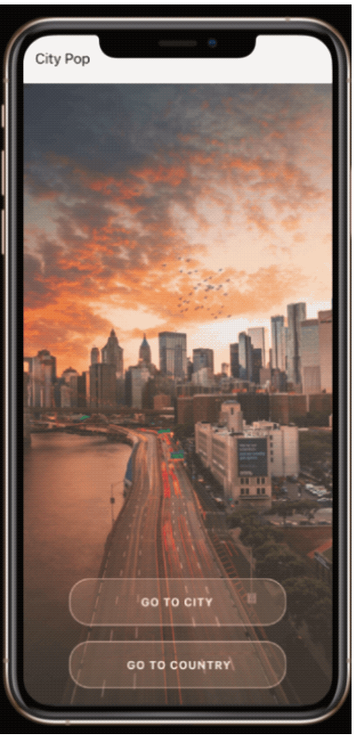

<br />

  <h1 align="center">City-Pop</h1>

</p>
<br />

<details open="open">
  <summary>Table of Contents</summary>
  <ol>
    <li>
      <a href="#about-the-project">About The Project</a>
      <ul>
        <li><a href="#built-with">Built With</a></li>
      </ul>
    </li>
    <li>
      <a href="#getting-started">Getting Started</a>
      <ul>
        <li><a href="#installation">Installation</a></li>
      </ul>
    </li>
    <li><a href="#contact">Contact</a></li>
  </ol>
</details>
----
<br />

## About The Project

<p align="center">
  <p>
    
  </p>

### Built With

- [React-Native] - Used framework
- [@react-navigation] - For screen navigation
- [TypeScript] - As main programming language
- [Node] - v14.17.6

## Getting Started

To setup this project locally you may follow the installation steps below.

### Installation

1. Clone the repo
   ```sh
   git clone https://github.com/kayzersozee/cities-app.git
   ```
2. Install NPM packages
   ```sh
   npm install
   ```
3. Start the project with expo
   ```sh
   npm start
   ```
4. If you have a simulator (Xcode or android studio)
   ```sh
   Press i to open
   ```
5. Download Expo Go on your mobile device
   ```sh
   Scan the  QR-Code to open
   ```

## Contact

**Author**

- [Nikolas Rosinelli](https://github.com/Kaayzeer)

Project Link: [https://github.com/Kaayzeer/cities-app](https://github.com/kayzersozee/cities-app)
